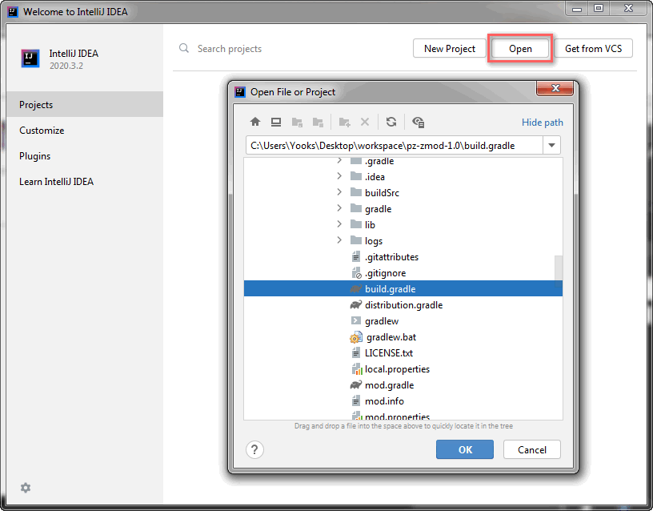
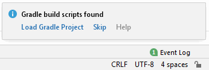
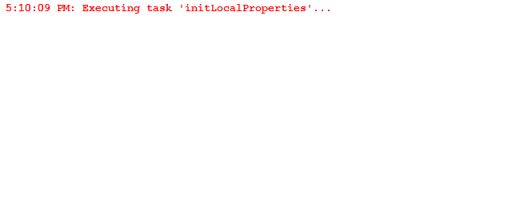

# ZomboidMod

[](https://github.com/cocolabs/pz-zmod/releases/latest)  [](https://mit-license.org/) [](https://discord.gg/vCeydWCbd9)

ZomboidMod is a compact mod development environment for [Project Zomboid](https://projectzomboid.com/blog/).

It is essentially a wrapper for you mod that enables powerful [IDE](https://en.wikipedia.org/wiki/Integrated_development_environment) features and improves your modding workflow. With a collection of [Gradle](https://gradle.org/) scripts it helps automate the process of setting up, assembling and deploying your project.

## Introduction

Whether you are a creating textures, models, maps or writing code you are working with often large and complex collections of files. These files need to be interpreted, and (in case of mod files) version controlled. Since we are human beings, we are not nearly as good at interpreting and storing raw data as machines are. This is why we need their help through advanced tools such as [Git](https://git-scm.com/) and IDE's. Git helps manage our mod versions, while an IDE provides powerful features to increase efficiency, offer code assistance, and make development more enjoyable.

- Increased efficiency means an overall higher mod quality.  
- Code analysis helps spot bugs and avoid lengthy debugging sessions. 
- Code navigation helps quickly find what we are looking for saving us time and energy.
- More enjoyable workflow brings more motivation used to create amazing mods.

ZomboidMod serves as an umbrella for these tools, connecting everything you need in one system.

## Features

- Decompiles and packages game classes to expose game engine code.
- Uses [ZomboidDoc](https://github.com/yooksi/pz-zdoc/) to compile a readable and always up-to-date modding Lua library.
- Compact workspace that can be used straight out of the box.
- Easy installation steps for enabling advanced features.
- Comes pre-configured for use with Git. 
- Fully integrates with IntelliJ IDEA.

## Where do I get it?

Download the [latest release](https://github.com/cocolabs/pz-zmod/releases/latest) from the repository.

Note that you **should not** clone the repository and use it as a template.
Instead, obtain the latest release and follow the [installation](#installation) instructions. 

## Installation

### Notes

- *Little question marks are hyperlinks that reveal more information when you hover over them.*
- *Lines that start with an arrow icon can be expanded to reveal more information.*

### Requirements

- Project Zomboid[<sup>?</sup>](#requirements "tested with 41.50-IWBUMS")
- [JDK 8](https://adoptopenjdk.net/?variant=openjdk8&jvmVariant=hotspot)[<sup>?</sup>](#requirements "tested with OpenJDK 1.8.0_282")
- [IntelliJ IDEA](https://www.jetbrains.com/idea/)
- [EmmyLua](https://plugins.jetbrains.com/plugin/9768-emmylua)

### Setup

- Download the [latest release](https://github.com/cocolabs/pz-zmod/releases/latest) from the repository.

- Extract the release archive in your local mod root directory (overwrite if updating).

- Make sure the root directory follows project naming standards:
  
  - Project name has to be all lower-case.
  - Project name has to start with `pz-` prefix.
  - Use dashes instead of whitespace and underscore characters.
  
- <details>
	<summary>Open the project as a Gradle project with Intellij IDEA<a href="https://www.jetbrains.com/help/idea/gradle.html#gradle_import_project_start"><sup>?</sup></a>.</summary>
	<br>
	<br>
</details>

- Ensure project SDK is set to JDK 8[<sup>?</sup>](https://www.jetbrains.com/help/idea/sdk.html#change-project-sdk).

- <details>
	<summary>Initialize mod by running <code>initializeMod</code> run configuration<a href="https://www.jetbrains.com/help/idea/run-debug-configuration.html"><sup>?</sup></a>.</summary>
	<br>
  </details>

- Prepare workspace by running `setupWorkspace` run configuration[<sup>?</sup>](https://www.jetbrains.com/help/idea/run-debug-configuration.html).

- Reload Gradle project[<sup>?</sup>](https://www.jetbrains.com/help/idea/work-with-gradle-projects.html#gradle_refresh_project).

- <details>
	<summary>Attach decompiled sources to classes.</summary>
	<ul>
	<li>Open project structure - <code>File -> Project Structure...</code></li>
	<li>Open <code>modules -> main -> Dependencies</code> panel.</li>
	<li>Find and select <code>zomboid-&ltversion&gt.jar</code> dependency.</li>
	<li>Click the little pencil icon to edit depdendency properties.</li>
	</ul>
	
	<p>You should now be in the window called <code>Configure Module Library</code>.</p>
	<ul>
	<li>Click the little plus icon (<code>Alt + Insert</code>) to attach files.</li>
	<li>In the new explorer window that just popped up find and select compiled sources which should be in <code>./lib/zomboid-&ltversion&gt-sources.jar</code> in project root directory.</li>
	<li>Click <code>OK</code> in all open windows to save and apply settings.</li>
	</ul>
	
</details>

### License

It is important to license your project with an appropriate open source license to ensure others have the right to copy, distribute or modify your work without being at risk of take-downs, shake-downs, or litigation.

Learn what happens when [you choose not to license your project](https://choosealicense.com/no-permission/).

ZomboidMod distributions contain a template MIT license for your project to use. Keep in mind that you can choose to license your project under a different license at any point in time. To apply the template license provided in the distribution to your project follow these steps:

- Update copyright in `LICENSE.txt` to include the current year and your name:

		Copyright (c) [year] [fullname]


- Update copyright in `README.md` under 'License' section to include your name and (optionally) a link to your Github profile, personal website, or another place online you can be reached:

		MIT © [Yourname](https://github.com/username)

Note that you can choose to include your full name or your Github username. It is a matter of preference and legally speaking both should be valid as long as you can prove the identity provided represents you. 

### Discord integration

If you are a Discord user and want to let the world know that you are working hard on your Project Zomboid mods you can do so with IntelliJ IDEA Discord integration.

#### Installation

- Install [Discord Integration](https://plugins.jetbrains.com/plugin/10233-discord-integration) IDEA plugin from the marketplace.
- Run `createDiscordIntegration` task.[<sup>?</sup>](#discord-integration "This task will run automatically when you run setupWorkspace configuration.")

Note that you need to write mod metadata (`mod.info`) before creating Discord integration so that the integration displays correct project name and description. However the integration is automatically setup after running `setupWorkspace` so you don't have to worry about that.

You can rerun the task at any time if you accidentally delete the configuration file.[<sup>?</sup>](#a ".idea/discord.xml")

## How to use

### Search scopes

IDEA [scopes](https://www.jetbrains.com/help/idea/settings-scopes.html) are sets of files you can search in various contexts. ZomboidMod generates custom search scopes to help you find code usages or references helpful in modding the game:

- `mod-lua` - All Lua files in `media` directory.
- `mod-media` - All files in `media` directory.
- `pz-java` - Project Zomboid Java classes.
- `pz-lua` - Project Zomboid Lua classes.

Learn more about [searching everywhere](https://www.jetbrains.com/help/idea/searching-everywhere.html) in IntelliJ IDEA.

### Changelog

> If you are not familiar with what a changelog is I recommend reading [keep a changelog](https://keepachangelog.com/en/1.0.0/).

ZomboidMod uses [github-changelog-generator](https://github.com/github-changelog-generator/github-changelog-generator) to generate standardized changelogs. Your should generate a changelog after each release, when all issues on project Github repository have been closed with a merge commit.

Before generating a changelog you need to do the following:

- Make sure you have designated repository `url` in `mod.info` file.

- Generate a [Github token](https://github.com/github-changelog-generator/github-changelog-generator#github-token) and store it in `local.properties`:

	```properties
	cg.token=<your-40-digit-token>
	```

That simply run `generateChangelog` task to generate project changelog.

## List of tasks

### Setup tasks

- `createLaunchRunConfigs` - Create game launch run configurations.
- `createModSearchScopes` - Create IDEA search scopes for mod files.
- `initLocalProperties` - Initialize local project properties.

### Documentation tasks

- `generateChangelog` - Generate a project changelog.

### Distribution tasks

- `assembleModDist` - Assembles the mod distributions.
- `modDistZip` - Bundles the project as a distribution.

### Mod tasks

- `applyModTemplate` - Apply Project Zomboid mod template.
- `createModStructure` - Create default mod directory structure.
- `initModInfo` - Initialize mod metadata information.
- `loadModInfo` - Load mod metadata information.
- `saveModInfo` - Save mod metadata to file.
- `showModInfo` - Print mod metadata information.

### Zomboid tasks

- `annotateZomboidLua` - Annotate vanilla Lua with EmmyLua.
- `compileZomboidLua` - Compile Lua library from modding API.
- `updateZomboidLua` - Run ZomboidDoc to update compiled Lua library.
- `decompileZomboid` - Decompile Project Zomboid classes.
- `zomboidClasses` - Assembles Project Zomboid classes.
- `zomboidJar` - Assembles a jar archive containing game classes.
- `zomboidLuaJar` - Assembles a jar containing compiled Lua classes.
- `zomboidSourcesJar` - Assembles a jar containing decompiled game sources.
- `zomboidVersion` - Read Project Zomboid game version.

## Discussion

- Feel free to [open a ticket](https://github.com/cocolabs/pz-zmod/issues/new) if you have any problems, questions or suggestions regarding the project.
- You are also welcome to join us on [Discord](https://discord.gg/vCeydWCbd9) to talk about modding and follow community projects.

## License

MIT © [Matthew Cain](https://github.com/yooksi)
