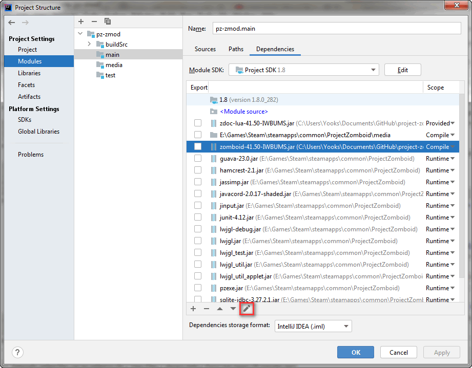
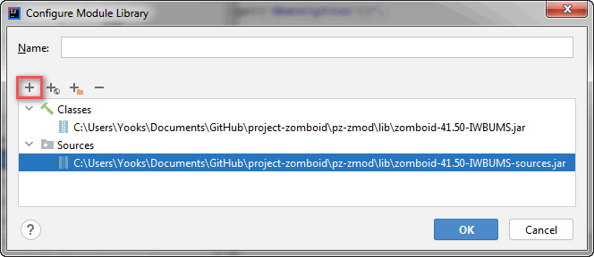

# ZomboidMod

ZomboidMod is a compact mod development environment for [Project Zomboid](https://projectzomboid.com/blog/).

It is essentially a wrapper for you mod that enables powerful [IDE](https://en.wikipedia.org/wiki/Integrated_development_environment) features and improves your modding workflow. With a collection of [Gradle](https://gradle.org/) scripts it helps automate the process of setting up, assembling and deploying your project.

## Introduction

Whether you are a creating textures, models, maps or writing code you are working with often large and complex collections of files. These files need to be interpreted, and (in case of mod files) version controlled. Since we are human beings, we are not nearly as good at interpreting and storing raw data as machines are. This is why we need their help through advanced tools such as [Git](https://git-scm.com/) and IDE's. Git helps manage our mod versions, while an IDE provides powerful features to increase efficiency, offer code assistance, and make development more enjoyable.

- Increased efficiency means an overall higher mod quality.  
- Code analysis helps spot bugs and avoid lengthy debugging sessions. 
- Code navigation helps quickly find what we are looking for saving us time and energy.
- More enjoyable workflow brings more motivation used to create amazing mods.

ZomboidMod serves as an umbrella for these tools, connecting everything you need in one system.

## Features

- Decompiles and packages game classes to expose game engine code.
- Uses [ZomboidDoc](https://github.com/yooksi/pz-zdoc/) to compile a readable and always up-to-date modding Lua library.
- Compact workspace that can be used straight out of the box.
- Easy installation steps for enabling advanced features.
- Comes pre-configured for use with Git. 
- Fully integrates with IntelliJ IDEA.

## Where do I get it?

Download the [latest release](https://github.com/real-coco-labs/pz-zmod/releases/latest) from the repository.

Note that you **should** not clone the repository and use it as a template.
Instead, obtain the latest release and follow the [installation](#installation) instructions. 

## Installation

### Notes

- *Little question marks are hyperlinks that reveal more information when you hover over them.*
- *Lines that start with an arrow icon can be expanded to reveal more information.*

### Requirements

- Project Zomboid[?](#requirements "tested with 41.50-IWBUMS")
- [JDK 8](https://adoptopenjdk.net/?variant=openjdk8&jvmVariant=hotspot)[?](#requirements "tested with OpenJDK 1.8.0_282")
- [IntelliJ IDEA](https://www.jetbrains.com/idea/)
- [EmmyLua](https://plugins.jetbrains.com/plugin/9768-emmylua)

### Setup

- Extract the release archive in your mod root directory (overwrite if updating).

- Make sure the root directory follows project naming standards:
  
  - Project name has to be all lower-case.
  - Project name has to start with `pz-` prefix.
  - Use dashes instead of whitespace and underscore characters.
  
- 

	
Open the project as a Gradle project with Intellij IDEA<a href="https://www.jetbrains.com/help/idea/gradle.html#gradle_import_project_start">?</a>.

	 
	 

- Ensure project SDK is set to JDK 8[?](https://www.jetbrains.com/help/idea/sdk.html#change-project-sdk).

- 

	
Initialize mod by running <code>initializeMod</code> run configuration<a href="https://www.jetbrains.com/help/idea/run-debug-configuration.html">?</a>.

	 
  

- Prepare workspace by running `setupWorkspace` run configuration[?](https://www.jetbrains.com/help/idea/run-debug-configuration.html).

- Reload Gradle project[?](https://www.jetbrains.com/help/idea/work-with-gradle-projects.html#gradle_refresh_project).

- 

	
Attach decompiled sources to classes.

	 
	  

## How to use

### Mod tasks

- `createModStructure` - Create default mod directory structure.
- `initModInfo` - Initialize mod metadata information.
- `loadModInfo` - Load mod metadata information.
- `saveModInfo` - Save mod metadata to file.
- `showModInfo` - Print mod metadata information.

### Zomboid tasks

- `annotateZomboidLua` - Annotate vanilla Lua with EmmyLua.
- `compileZomboidLua` - Compile Lua library from modding API.
- `decompileZomboid` - Decompile Project Zomboid classes.
- `zomboidClasses` - Assembles zomboid classes.
- `zomboidJar` - Assembles a jar archive containing game classes.
- `zomboidLuaJar` - Assembles a jar containing compiled lua classes.
- `zomboidSourcesJar` - Assembles a jar containing decompiled game sources.
- `zomboidVersion` - Read Project Zomboid game version.